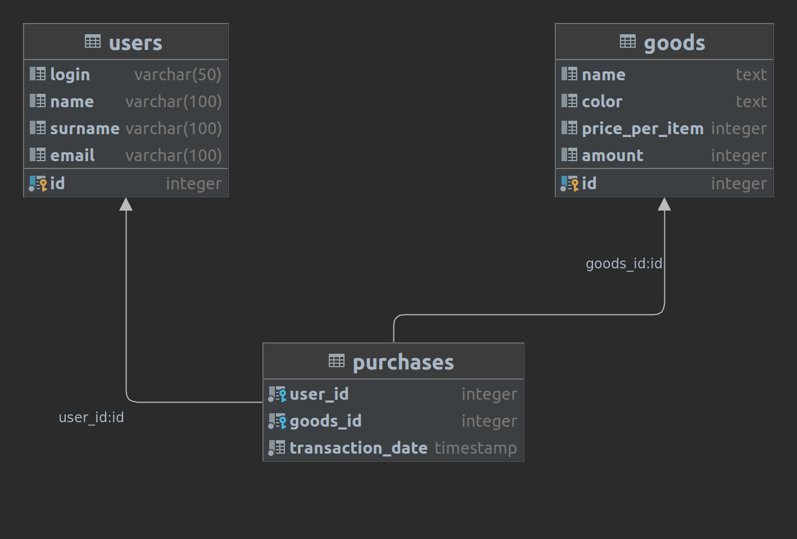

# SQL шаблоны и базовые концепции

В этом демо репозитории мы будем работать с SQL, посмотрим на основные концепции.
Помимо этого данный репозиторий будет содержать DDL для создания тестовых таблиц,
чтобы в любой момент можно было потыкать те или иные команды SQL.

## Развернуть СУБД

В этом демо будем работать с PostgreSQL.
Чтобы развернуть эту таблицу, воспользуемся докером.
Таким образом, для работы необходимо будет установить докер на
компьютер ([ссылка на документацию](https://docs.docker.com/engine/install/))

Постгрес поднимается следующей командой:

```shell
docker volume create postgres_vol
```

```shell
docker run --rm -d \
  --name pg \
  -v postgres_vol:/var/lib/postgresql/data \
  -p 127.0.0.1:5432:5432 \
  -e POSTGRES_USER=admin \
  -e POSTGRES_PASSWORD=admin \
  -e POSTGRES_DB=app \
  postgres:14
```

В результате мы явно создадим вольюм (чтоб сохранять данные на диск) и поднимем постгресс, который будет доступен со
следующими подключениями:

- **хост** - localhost (127.0.0.1)
- **порт** - 5432
- **логин** - admin
- **пароль** - admin
- **база данных** - app

После работы нужно выполнить следующие команды:

```shell
docker stop pg
```

```shell
docker volume rm postgres_vol
```

## Тестовый шаблон базы данных



Чтобы сгенерировать эти таблички, нужно воспользоваться файликом **template_dump.dump**.

Данный файл был получен путем `pg_dump` из контейнера.

Чтобы загрузить данные, нужно передать это в psql:

```shell
docker exec -i pg psql -U admin --dbname app < template.dump
```

